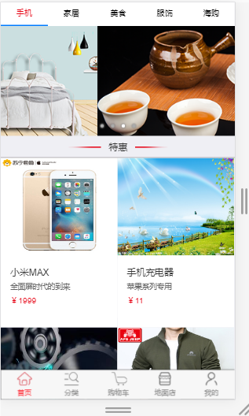

## 基于html5+ 的流应用电子商城
## 概述

这是一个 基于html5+ 的流应用电子商城，有以下几个特点：
1.基于html5+,可以在安卓，ios等平台上使用，只需要一次开发
2.使用了MUI框架，JQuery框架
3.使用python搭建服务器

#### 说明：目前进行界面的开发，实现界面间的跳转和数据的获取

## 应用截图
pic1.png

(------tan90°-------)

## 快速体验

(------tan90°-------)

## 使用教程

(------tan90°-------)
